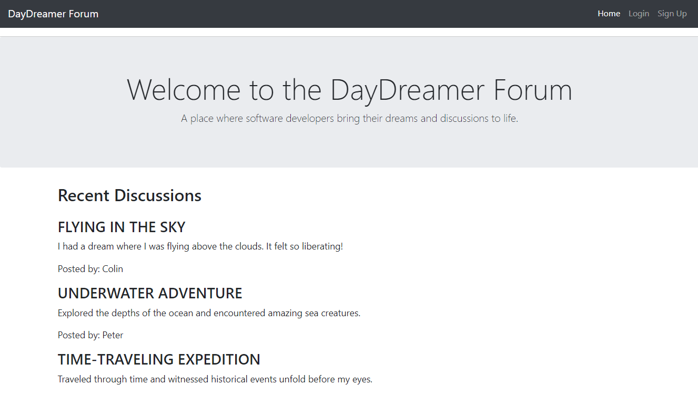
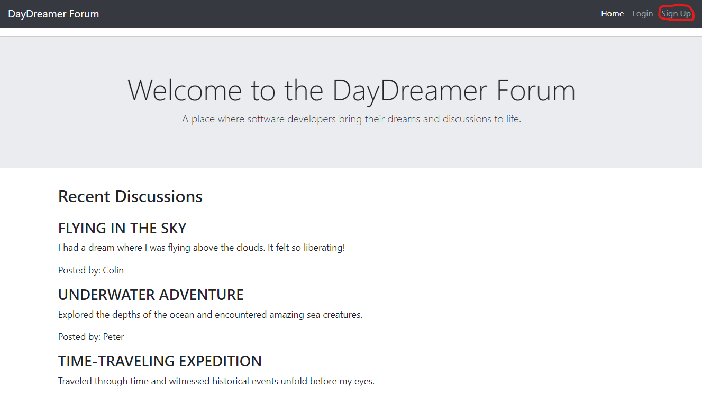
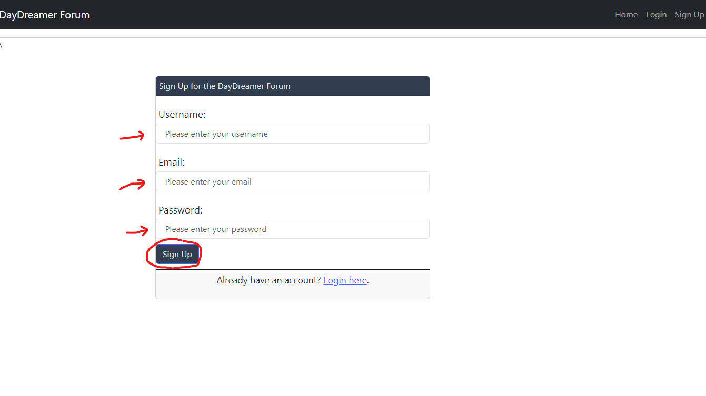
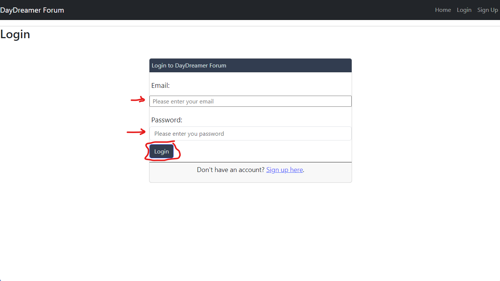
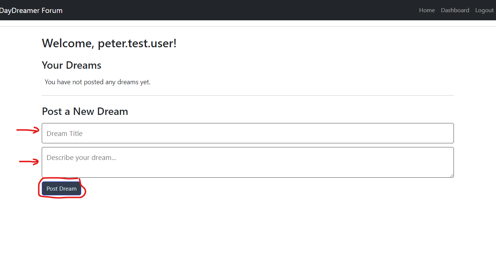
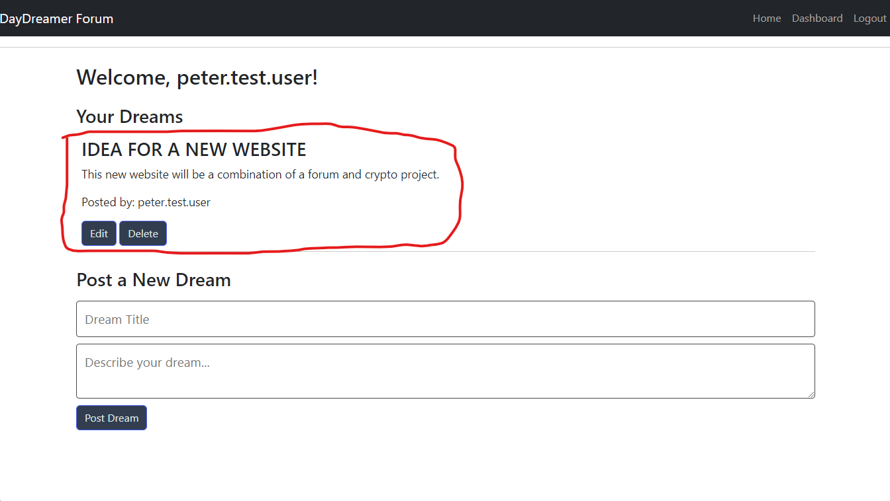

# DayDreamer

DayDreamer is a social platform exclusively for software developers to post, share, and refine their software development ideas and prototypes.



## Table of Contents

- [Features](#features)
- [Getting Started](#getting-started)
- [Installation](#installation)
- [Usage](#usage)
- [Links](#links)
- [Contributing](#contributing)
- [License](#license)

## Features

- Post and discuss software development ideas and prototypes
- Collaborate with like-minded individuals

## Getting Started

These instructions will get you a copy of the project up and running on your local machine for development and testing purposes.

## Installation

To install the application, follow these steps:

1. Clone the repository to your local machine:

   ```bash
   git clone https://github.com/mkdkck/DayDreamer.git
   ```

2. To install the necessary dependencies, run the following command:

   ```bash
   npm install
   ```

3. Create a .env file in the root directory and fill it with your own environment variables:

   ```bash
   DB_USERNAME=yourUsername
   DB_PASSWORD=yourPassword
   DB_NAME=daydreamer_db
   DB_HOST=localhost
   ```

4. Run the application:

   ```bash
   npm start
   ```

## Usage

1. Open a browser and visit http://localhost:3000/ (change the port if needed).


2. Click the sign up button.



3. Enter your desired username, email and password to create an account.



4. You will be taken to the login screen, enter your details and click the login button.



5. You will be taken to the login screen, enter your details and click the login button.


6. You will be taken to the dashboard screen, enter your dream details and click the login button.



7. Your dream will now be posted and visible to other users.



## Links

Here are some important links for the project:

- Github Repo: https://github.com/mkdkck/DayDreamer.git 
- Heroku Deployed: https://daydreamer-591de2b859e8.herokuapp.com/ 

## Contributing

Contributions to this project are welcome. Please ensure your pull requests adhere to the following guidelines:

- Descriptive commit messages.
- Clear, readable code with proper documentation.
- Changes that are relevant to the project objectives.

## License

This project is licensed under the [MIT License](LICENSE).